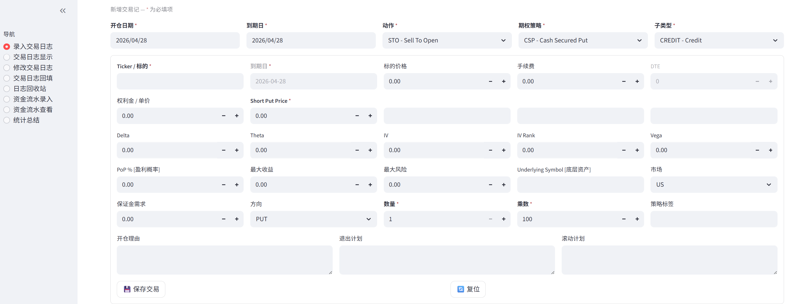
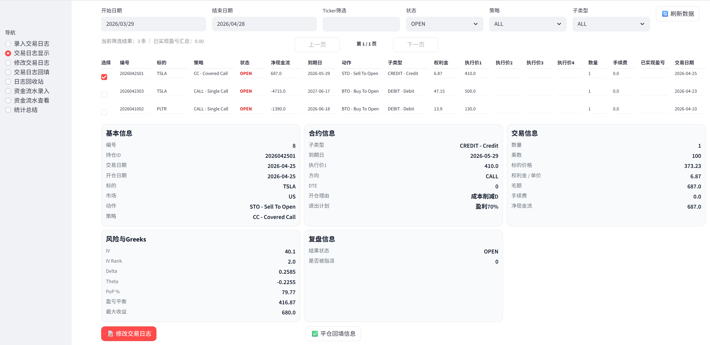
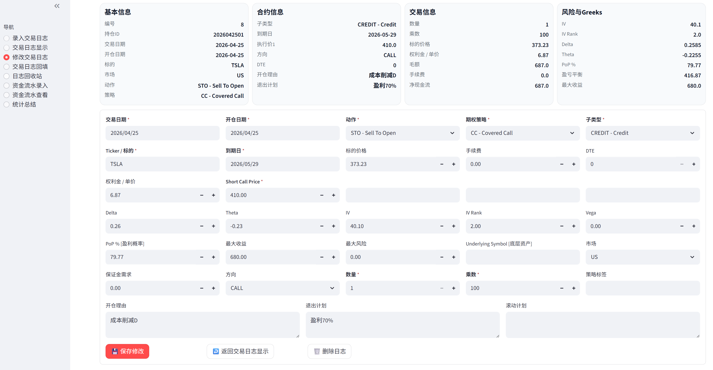
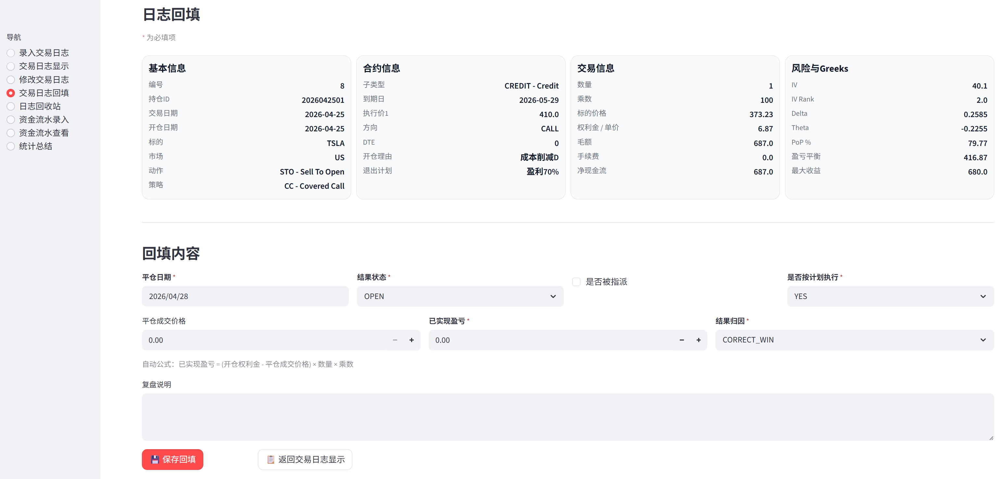

# 期权交易记录日志

期权交易日志系统，基于：
- Streamlit
- SQLite
- Plotly
- Lightweight Charts

## 功能
- 交易日志录入
- 交易日志显示与筛选
- 日志回填 / 复盘/ 删除
- 统计总结
- 资金流水管理
- 权益曲线展示

## 项目结构
- `app.py`：主程序
- `db.py`：SQLite 初始化与读写
- `utils/enums.py`：下拉选项与标签
- `utils/metrics.py`：统计与计算函数
- `data/tradinglog.db`：数据库文件（自动创建）

## 使用方法
## 开发与测试目录为 D:\apps\OptionsTradingLog
```bash
cd D:\apps\OptionsTradingLog
pip install -r requirements.txt
streamlit run app.py```


## 交易日志录入


## 交易日志列表


## 修改/删除日志


## 期权平仓日志



